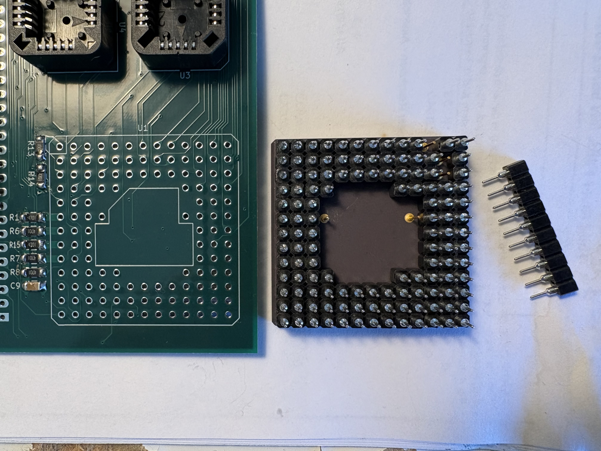
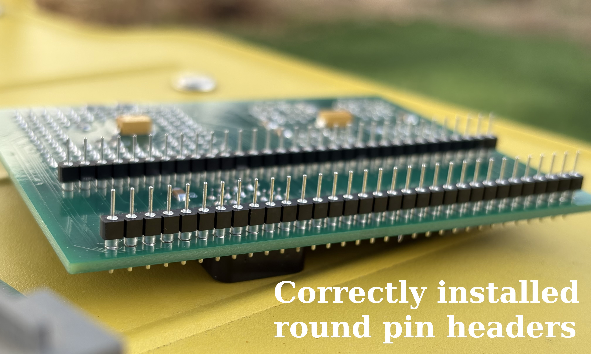
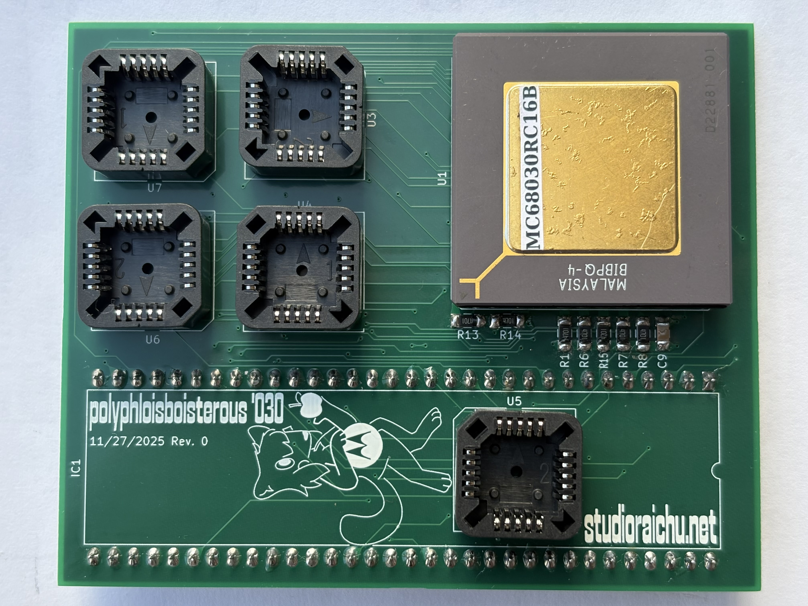
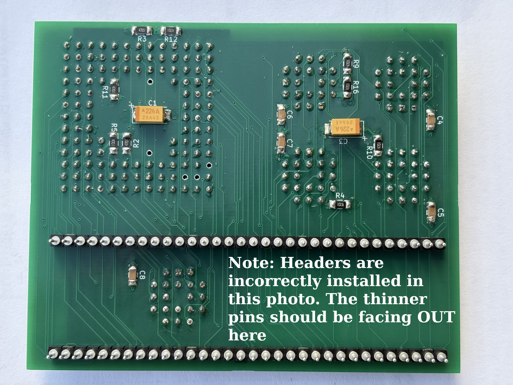
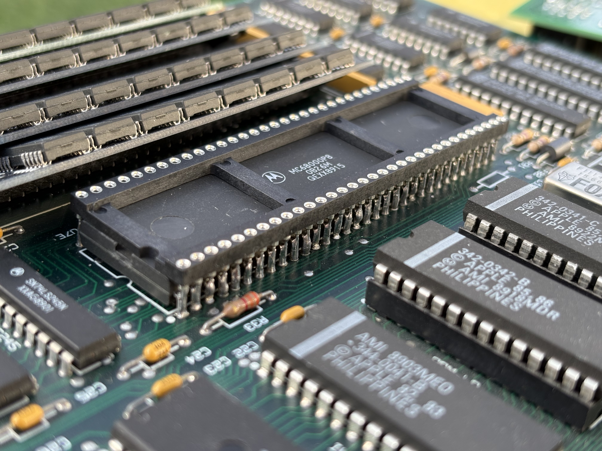
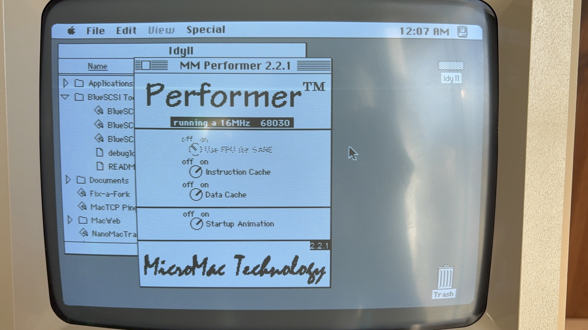
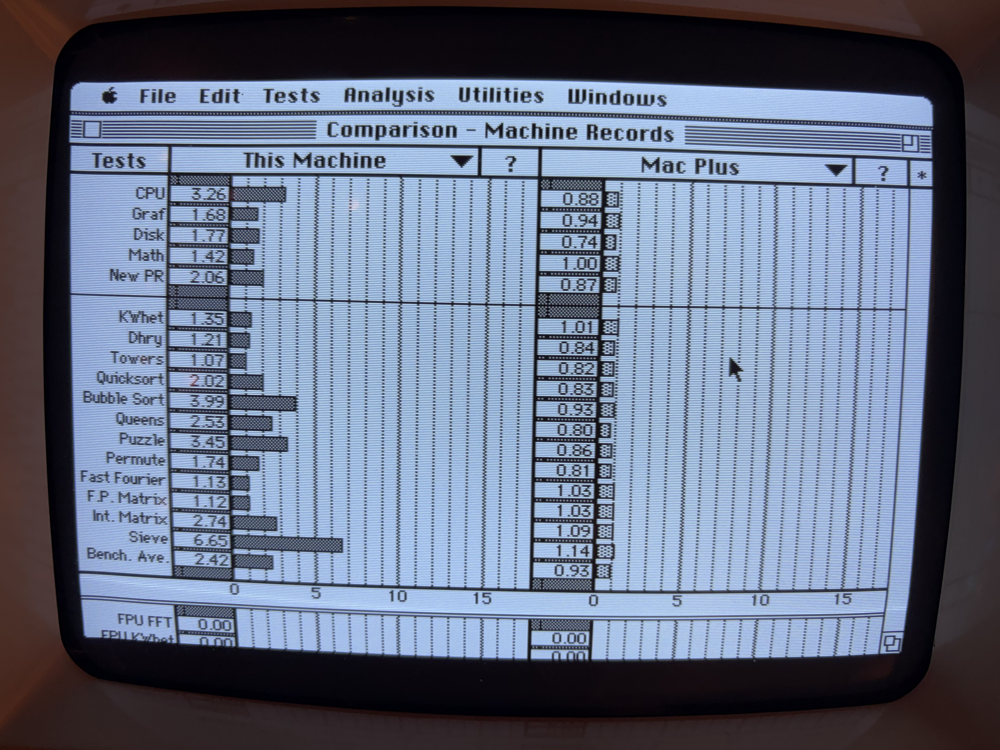

# Polyphloisboisterous '030

This is my 16MHz 68030 microprocessor upgrade board for Apple's Macintosh Plus, derived from the [reverse-engineered](https://github.com/alxlab-zone66x/Performer-SE-PL-CL/tree/main) MicroMac Performer. It is designed for easy and low-cost assembly by hobbyists.

I created it because I didn't want to pay the relatively high manufacturing costs to get five Performer clone boards made, and I would have a hard time surface mount soldering the GALs.

My board is 50% smaller and 77% cheaper to manufacture over the original Performer, and doesn't use any dense SMD footprints. It can be assembled by anyone who can recap a vintage computer motherboard.

The provided PCB files are licensed under CC BY-NC-SA - they're NOT intended for commercial use.

## Notes on GALs

The original Performer GALs have been dumped. GAL16V8-15, PALCE16V8-15, and ATF16V8-15 have been tested as suitable replacements.

I used ATF16V8B-15JU, they are in stock at DigiKey and Mouser.

Faster/slower chips haven't been tested so far.

I used [afterburner](https://github.com/ole00/afterburner) to program GALs cheaply.

## Why is the FPU missing?

Because it's seldomly used on the Macintosh, and the PCB layout is simpler without it. There's not much point in having super fast floating point math when very little software uses it and if it'll be bottlenecked by the 16MHz CPU and 16-bit data bus.

## Bill of Materials

|Quantity|Description|Designators|
|--------|-----------|-----------|
|16|4.7 kΩ resistor, 1/4W or better, 1206 package|R1, R2, R3, R4, R5, R6, R7, R8, R9, R10, R11, R12, R13, R14, R15, R16|
|6|0.1μF ceramic capacitor, 6.3V or better, 1206 package|C4, C5, C6, C7, C8, C9|
|2|22μF tantalum capacitor, 10V or better, 2312 package|C1, C3|
|5|20 (4 x 5) pos. PLCC socket, through hole|U3, U4, U5, U6, U7|
|5|16V8 GALs or PALs, ATF16V8 recommended|U3, U4, U5, U6, U7|
|1|**Optional:** PGA-128 socket or equivalent for 68030. I used discrete machined pin headers|U1|
|1|MC68030, PGA, at least 16MHz|U1|
||Headers and sockets to stack Polyphloisboisterous '030 on top of 68000. I used two 32 pos. round pin headers with a 64 (2 x 32) pos. machined pin DIP socket|IC1|

## Revision History
* 11/27/2025 Rev. 0 - First version
* 12/26/2025 Rev. 1 - Made board slightly shorter to help clear top of SIMM 1

## Assembly
1. Solder passives (resistors, capacitors) to board.

2. Solder GAL sockets to board.

3. Either solder PGA socket to board or permanently solder 68030 directly to board. In my case, I pushed individual pin headers onto the 68030 before soldering it. See [this graphic](img/cpuheaders-diagram.png) for my placement of these headers.

4. Solder 68000 piggyback connector(s) (i.e. male pin headers) to board.

5. Program GALs and insert into sockets.

Your board should look like this:

## Installation
1. Solder piggyback connector (i.e. female machined pin DIP socket) on top of the 68000 microprocessor on the Macintosh Plus logic board.

2. Seat the Polyphloisboisterous '030 accelerator on top of the 68000. It should look as pictured. Be mindful of the top of SIMM 1.

3. Make a test: Have the logic board next to the Mac and connect the multicolored wire harness. Make sure that the logic board or accelerator do not touch any metal part of the chassis. Turn power on and listen for the beep. If you get a beep the accelerator is working. Turn power off and continue with the installation.

4. Carefully slide the logic board back into position while watching the accelerator **or** alternatively slide it **underneath** the rails and into the chassis, then slot the logic board into a rail on one side and bend the chassis on the other side in such a way that the logic board does go into the other rail as well.

5. Download the [Performer control panel](https://web.archive.org/web/20000531231408/https://www.micromac.com/software/performer2.2.1.sit.hqx), unstuff it, and install in your System Folder. It should show that you have a 16MHz 68030.

## Performance
For best results, use System 6.

System 7 will boot but some applications crash with the accelerator installed.

Here are the benchmark results from Speedometer 3.23:

## Thanks
To Bolle and Trash80toHP_Mini of 68kMLA forums, for reverse engineering the Mercury 030 and MicroMac Performer.

To alxlab-zone66x, for converting the Performer EAGLE files to a KiCad project.

